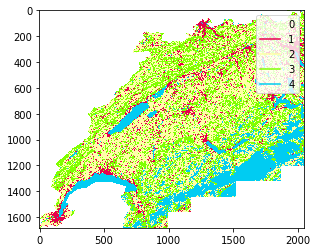
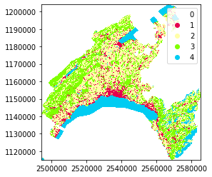

[](https://pypi.python.org/pypi/swisslandstats-geopy/)
[](https://travis-ci.org/martibosch/swisslandstats-geopy)
[](https://coveralls.io/github/martibosch/swisslandstats-geopy?branch=master)
[](https://github.com/martibosch/swisslandstats-geopy/blob/master/LICENSE.txt)

# swisslandstats-geopy

Python tools for the [Swiss Land Statistics datasets from the Swiss Federal Statistical Office](https://www.bfs.admin.ch/bfs/fr/home/services/geostat/geodonnees-statistique-federale/sol-utilisation-couverture/statistique-suisse-superficie.html) (link in French)

## Features

* Automatically transform files from the Swiss Federal Statistical Office into dataframes
* Transform categorical land use/land cover information into `numpy` arrays and `GeoTIFF` files
* Plot categorical land use/land cover information with legend and the appropriate color map
* Clip dataframes by vector geometries

```python
import swisslandstats as sls

ldf = sls.read_csv('data/AREA_NOAS04_72_171129.csv')
ldf.plot('AS09R_4', cmap=sls.noas04_4_cmap, legend=True)
```


```python
vaud_ldf = sls.clip_by_nominatim(ldf, 'Vaud, Switzerland')
vaud_ldf.plot('AS09R_4', cmap=sls.noas04_4_cmap, legend=True)
```


See the [example notebook](https://github.com/martibosch/swisslandstats-geopy/blob/master/examples/overview.ipynb) for an overview

## Installation

If you want to be able to clip dataframes by vector geometries, you will need [geopandas](https://github.com/geopandas/geopandas) (and [osmnx](https://github.com/gboeing/osmnx) to clip dataframes from place names e.g., "Zurich, Switzerland"). The easiest way to install such requirements is via conda as in:

``` bash
# install the cythonized geopandas
conda install -c conda-forge/label/dev geopandas
conda install -c conda-forge osmnx
```

Then you can install `swisslandstats-geopy` via pip as in:

``` bash
pip install swisslandstats-geopy
```

**Important notes**:

* The [cythonized geopandas](https://jorisvandenbossche.github.io/blog/2017/09/19/geopandas-cython/) can give you vast speed-ups when clipping dataframes e.g., 32.7 ms instead of 51.8 s (x1584) to clip by the dataframe by canton of Vaud. However, [the cythonized geopandas is not production code yet](https://github.com/geopandas/geopandas/issues/473). If other libraries of your environment depend on geopandas, it might be better to install its (slower) stable version as in `conda install -c conda-forge geopandas`.

* Depending on your environment, you might get an `error while loading shared libraries: libncurses.so.6`. You might solve it by `conda install -c conda-forge ncurses`

## Description of the datasets

More information can be found in the [Swiss Federal Statistical Office page](https://www.bfs.admin.ch/bfs/fr/home/services/geostat/geodonnees-statistique-federale/sol-utilisation-couverture/statistique-suisse-superficie.html) (in German and French)

* [Standard nomenclature](https://www.bfs.admin.ch/bfs/fr/home/services/geostat/geodonnees-statistique-federale/sol-utilisation-couverture/statistique-suisse-superficie/nomenclature-standard.html) `NOAS04` with 72 base categories that combine information on land cover and land use
* [Land cover nomenclature](https://www.bfs.admin.ch/bfs/fr/home/services/geostat/geodonnees-statistique-federale/sol-utilisation-couverture/statistique-suisse-superficie/occupation-sol.html) `NOLC04` with 27 categories of land cover
* [Land use nomenclature](https://www.bfs.admin.ch/bfs/fr/home/services/geostat/geodonnees-statistique-federale/sol-utilisation-couverture/statistique-suisse-superficie/utilisation-sol.html) `NOLU04` with 46 categories of land use


## TODO

* Add missing colormaps
  * Automatically assign columns to cmaps when plotting
* Exceptions for no land use/land cover columns
* Cache colum ndarrays as class attributes?
* Implement methods to merge DataFrames from multiple csv files
* Conda recipe
