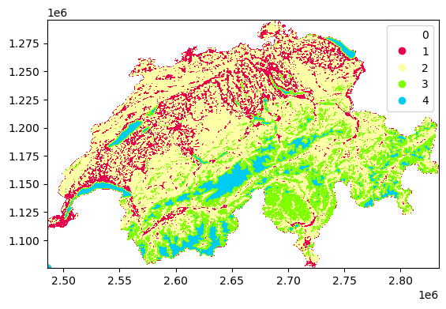

[](https://pypi.python.org/pypi/swisslandstats-geopy/)
[](https://swisslandstats-geopy.readthedocs.io/en/latest/?badge=latest)
[](https://travis-ci.org/martibosch/swisslandstats-geopy)
[](https://coveralls.io/github/martibosch/swisslandstats-geopy?branch=master)
[](https://github.com/martibosch/swisslandstats-geopy/blob/master/LICENSE.txt)
[](https://mybinder.org/v2/gh/martibosch/swisslandstats-geopy/master?filepath=examples/overview.ipynb)
[](http://joss.theoj.org/papers/b6de0f096382d4dcd5d137a3f1edcb30)
[](https://zenodo.org/badge/latestdoi/151926572)

# swisslandstats-geopy

Extended pandas-like interface for the [Swiss Land Statistics datasets from the Swiss Federal Statistical Office (SFSO)](https://www.bfs.admin.ch/bfs/fr/home/services/geostat/geodonnees-statistique-federale/sol-utilisation-couverture/statistique-suisse-superficie.html) (link in French).

**Citation**: Bosch M. 2019. "swisslandstats-geopy: Python tools for the land statistics datasets from the Swiss Federal Statistical Office". The Journal Open Source Software 4(40), 1511. https://doi.org/10.21105.joss.01511

The Swiss Land Statistics inventory by the SFSO is stored in a relational database format which allows storing the different survey periods into a single CSV file, nevertheless, libraries to process geographical raster data aree rarely capable of processing such format. Therefore, the aim of `swisslandstats-geopy` is to provide an extended pandas `DataFrame` interface to such inventory (see [the "Features" section below](#features)).

The target audience of `swisslandstats-geopy` is researchers and developers in environmental sciences and GIS, who intend to produce repeatable and reproducible computational workflows that make use of the land use/land cover inventory provided by the SFSO. 

## Features

* Automatically read CSV files from the SFSO into dataframes
* Export categorical land use/land cover columns into `numpy` arrays and `GeoTIFF` files
* Clip dataframes by vector geometries
* Plot categorical land use/land cover information

```python
import swisslandstats as sls

ldf = sls.read_csv('data/AREA_NOAS04_72_171129.csv')
ldf.plot('AS09R_4', cmap=sls.noas04_4_cmap, legend=True)
```


```python
vaud_ldf = ldf.clip_by_nominatim('Vaud, Switzerland')
vaud_ldf.plot('AS09R_4', cmap=sls.noas04_4_cmap, legend=True)
```


See the [example notebook](https://github.com/martibosch/swisslandstats-geopy/tree/master/examples/overview.ipynb) for a more thorough overview (or click the Binder badge above to execute it interactively in your browser).

Examples of applications of the library in the academic literature include:

* The assessment of the carbon sequestration for the canton of Vaud (see [the dedicated GitHub repository](https://github.com/martibosch/carbon-sequestration-vaud) with the materials necessary to reproduce the results)
* The evaluation of the spatio-temporal patterns of LULC change in the urban agglomerations of Zurich, Bern and Lausanne (see [the dedicated GitHub repository](https://github.com/martibosch/swiss-urbanization) with the materials necessary to reproduce the results).


## Installation

If you want to be able to clip dataframes by vector geometries, you will need [geopandas](https://github.com/geopandas/geopandas) (and [osmnx](https://github.com/gboeing/osmnx) to clip dataframes from place names e.g., "Zurich, Switzerland"). The easiest way to install such requirements is via conda as in:

``` bash
conda install -c conda-forge geopandas osmnx
```

Then you can install `swisslandstats-geopy` via pip as in:

``` bash
pip install swisslandstats-geopy
```

**Important notes**:

* The [cythonized geopandas](https://jorisvandenbossche.github.io/blog/2017/09/19/geopandas-cython/) can give you vast speed-ups when clipping dataframes e.g., 32.7 ms instead of 51.8 s (x1584) to clip by the dataframe by canton of Vaud. You might install it as in:

``` bash
# install the cythonized geopandas
conda install -c conda-forge/label/dev geopandas
```

However, [the cythonized geopandas is not production code yet](https://github.com/geopandas/geopandas/issues/473). If other libraries of your environment depend on geopandas, it might be better to install its (slower) stable version as in `conda install -c conda-forge geopandas`.

* Depending on your environment, you might get an `error while loading shared libraries: libncurses.so.6`. You might solve it by `conda install -c conda-forge ncurses`

## Description of the datasets

More information can be found in the [Swiss Federal Statistical Office page](https://www.bfs.admin.ch/bfs/fr/home/services/geostat/geodonnees-statistique-federale/sol-utilisation-couverture/statistique-suisse-superficie.html) (in German and French)

* [Standard nomenclature](https://www.bfs.admin.ch/bfs/fr/home/services/geostat/geodonnees-statistique-federale/sol-utilisation-couverture/statistique-suisse-superficie/nomenclature-standard.html) `NOAS04` with 72 base categories that combine information on land cover and land use
* [Land cover nomenclature](https://www.bfs.admin.ch/bfs/fr/home/services/geostat/geodonnees-statistique-federale/sol-utilisation-couverture/statistique-suisse-superficie/occupation-sol.html) `NOLC04` with 27 categories of land cover
* [Land use nomenclature](https://www.bfs.admin.ch/bfs/fr/home/services/geostat/geodonnees-statistique-federale/sol-utilisation-couverture/statistique-suisse-superficie/utilisation-sol.html) `NOLU04` with 46 categories of land use


## TODO

* Add missing colormaps
  * Automatically assign columns to cmaps when plotting
* Exceptions for no land use/land cover columns
* Cache colum ndarrays as class attributes?
* Implement methods to merge DataFrames from multiple csv files
* Conda recipe
