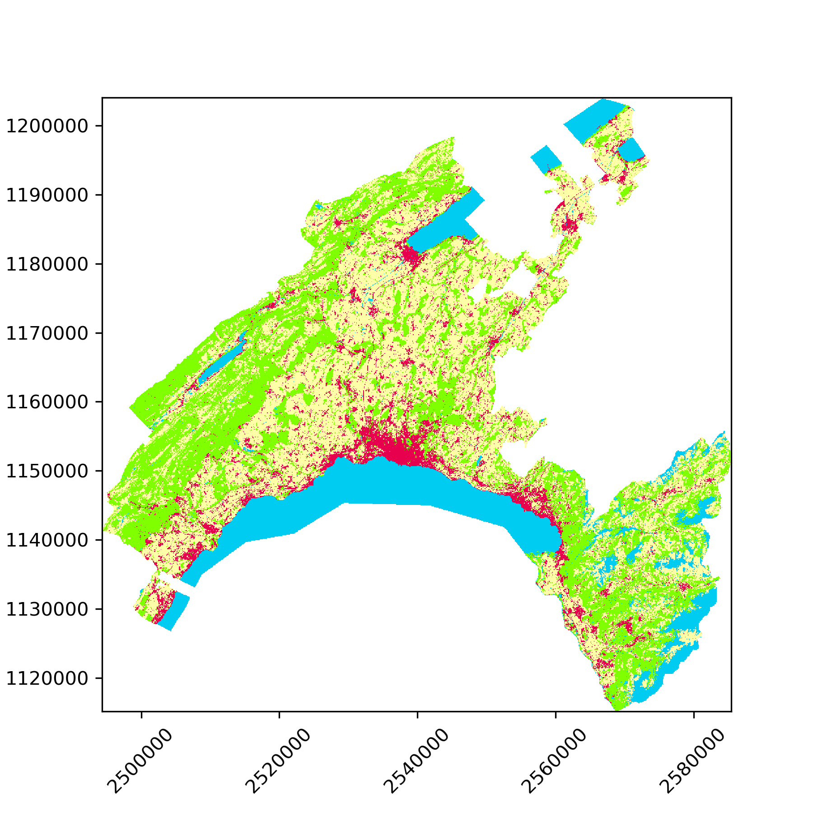

# Summary

The Swiss Land Statistics inventory by the Swiss Federal Statistical Office (SFSO) [@sfso2017statistique] provides land use/land cover (LULC) datasets at the Swiss national extent for a sequence of four survey periods in 1979/85, 1992/97, 2004/09 and 2013/18. The data is stored in a relational database format, where each row corresponds to one of the hectometric pixels that configure the Swiss territory, and features three groups of columns:

* Firstly, the `E` and `N` columns denote the coordinates of the pixel's centroid in the LV95 coordinate reference system (or alternatively `X` and `Y` in LV03). 
* Secondly, the `FJ85`, `FJ97`, `FJ09` and `FJ18` columns denote the exact years when the observations for each of the four survey periods were taken. For instance, the first dataset was produced between 1979 and 1985. Accordingly, for each row/pixel, the `FJ85` column will denote the exact year where its LULC category attribution was made (it can be any year within the 1979/85 period, depending on the part of Switzerland).
* Thirdly, the LULC data is provided in three different nomenclatures: the *standard nomenclature*, which feature 72 categories that combine land use and land cover information; the *land cover* nomenclature and the *land use nomenclature*. Accordingly, the LULC information for each pixel is stored in columns of the form `LC85_27`, where `LC` denotes the *land cover nomenclature*, `85` the survey period 1979/85 and `27` the number of categories considered. 

The inventory for each nomenclature can be downloaded as a comma-separated value (CSV) file. For instance, the *standard nomenclature* aggregated to 17 categories can be download freely, and is of the form:

E       | N       | FJ85 | ... | FJ18 | AS85_17 | ... | AS18_17 |
:-----: | :-----: | ---- | --- | ---- | :-----: | --- | :-----: |
2485500 | 1109700 | 1980 | ... | 2012 |      10 | ... |      10 |
2485500 | 1109800 | 1980 | ... | 2012 |      10 | ... |      10 |
2485500 | 1109900 | 1980 | ... | 2012 |      10 | ... |      10 |
2485500 | 1110000 | 1980 | ... | 2012 |      10 | ... |      10 |
2485500 | 1110100 | 1980 | ... | 2012 |      10 | ... |      10 |
2485600 | 1109800 | 1980 | ... | 2012 |       7 | ... |       7 |
    ... |     ... |  ... | ... |  ... |     ... | ... |     ... |

While the above structure allows storing the different survey periods into a single file which can be straightforwardly read by most data analysis packages, libraries to process geographical raster data are rarely capable of processing such a format. Therefore, the aim of the proposed library, swisslandstats-geopy, is to provide an extended pandas `DataFrame` interface [@mckinney2010data] to the table-like LULC inventory provided by the SFSO, which includes the following features:

* Read CSV files from the SFSO into `LandDataFrame` objects, which extend the conventional pandas `DataFrame` with additional attributes that store the coordinate reference system (CRS) and pixel resolution.

    ```python
    import swisslandstats
    ldf = swisslandstats.read_csv('data/AREA_NOAS04_17_181029.csv')
    ```

* Export the categorical LULC columns into NumPy arrays [@van2011numpy] and GeoTIFF files

    ```python
    ldf.to_ndarray('AS18_4')
    ```
    
    ```
    array([[3, 0, 0, ..., 0, 0, 0],
          [0, 0, 0, ..., 0, 0, 0],
          [0, 0, 0, ..., 0, 0, 0],
          ...,
          [3, 3, 2, ..., 0, 0, 0],
          [3, 3, 3, ..., 0, 0, 0],
          [3, 2, 2, ..., 0, 0, 0]], dtype=uint8)
    ```


* Clip `LandDataFrame` instances by Shapely vector geometries [@gillies2007shapely] or directly by region names. The latter uses OSMnx [@boeing2017osmnx] to retrieve the geometries from the [OpenStreetMap](https://www.openstreetmap.org/)

    ```python
    vaud_ldf = ldf.clip_by_nominatim(Vaud, Switzerland')
    ```
    
* Plot the categorical LULC columns as raster images (see Figure 1)

    ```python
    ax = vaud_ldf.plot('AS09R_4')
    ax.tick_params(axis='x', rotation=45)
    ``` 
    
    

The target audience of swisslandstats-geopy is researchers and developers in environmental sciences and GIS, who intend to produce repeatable and reproducible computational workflows that make use of the LULC inventory provided by the SFSO. Examples of applications of the library in the academic literature include the assessment of the carbon sequestration for the canton of Vaud [@jaligot2019assessing, see also [a dedicated GitHub repository](https://github.com/martibosch/carbon-sequestration-vaud) with the materials necessary to reproduce the results], and the evaluation of the spatio-temporal patterns of LULC change in the urban agglomerations of Zurich, Bern and Lausanne [@bosch2019spatiotemporal, see also [a dedicated GitHub repository](https://github.com/martibosch/swiss-urbanization) with the materials necessary to reproduce the results].

On the other hand, the `settings` module of swisslandstats-geopy allows changing the CRS and pixel resolution so that the library might also be used with similarly table-like raster datasets. For instance, a dataset of phenology in the Eastern US and Canadian forests for the 1984-2013 period [@melaas2018landsat] has been processed seamlessly into a `LandDataFrame` instance. Nevertheless, although other table-like raster datasets such as the European land use/cover area frame statistical survey (LUCAS) [@ballin2018redesign] could be instantiated as `LandDataFrames`, the data could not be converted to NumPy arrays, likely because of the CRS and how their grid is sampled. Further exploration of the characteristics that a table-like raster dataset must fulfill in order to be seamlessly procesed within swisslandstats-geopy could signficantly enhance the reusability of the library.


# Availability

The source code of swisslandstats-geopy is fully available at [a GitHub repository](https://github.com/martibosch/swisslandstats-geopy). A dedicated Python package has been created and is hosted at the [Python Package Index (PyPI)](https://pypi.org/project/swisslandstats-geopy/). The documentation site is hosted at [Read the Docs](https://swisslandstats-geopy.readthedocs.io/), and an example Jupyter notebook with an overview of the library's features is provided at a [dedicated GitHub repository](https://github.com/martibosch/swisslandstats-notebooks), which can be executed interactively online with the SFSO free tier LULC dataset by means of the Binder web service [@jupyter2018binder]. 

Unit tests are run within the [Travis CI](https://travis-ci.org/martibosch/swisslandstats-geopy) platform every time that new commits are pushed to the GitHub repository. Additionally, test coverage [is reported on Coveralls](https://coveralls.io/github/martibosch/swisslandstats-geopy?branch=master).


# Acknowledgments

This research has been supported by the École Polytechnique Fédérale de Lausanne.


# References
